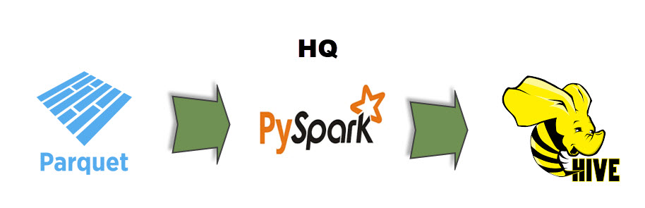

# fictional-train

This project simulates a B2B scenario.  In this scenario, we have a retailer that sends
sales data to a third party (here termed "HQ") that generates BI reports from the data.
The retailer might be one of many retailers that sends data to HQ.

The retailer maintains a RDBMS to record sales transactions.  However, HQ doesn't have
access to the retailer's RDBMS and therefore cannot directly use the stored data to
generate BI reports.  To resolve this, the retailer has decided to export the RDBMS tables
to JSON files.  The tables are normalized so there is a need to consolidate data.  The 
retailer has also decided to send the data in PARQUET files.

The retailer has a PySpark application for its needs.  The following image presents an
overview of the retailer's operation:

The retailer simulates sending the files to HQ by writing files to `data/output/retailer`.

HQ consumes the files set by the retailer.

HQ has a PySpark application for its needs.  The following image presents an
overview of HQ's operation:

HQ writes files to `data/output/hq`.
