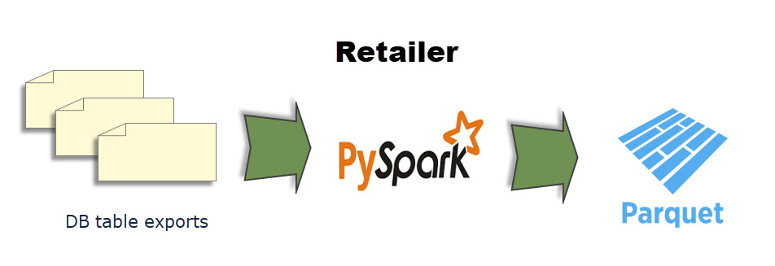

# fictional-train

This project simulates a B2B scenario.  In this scenario, we have a retailer that sends
sales data to a third party (here termed "HQ") that in turn generates BI reports from the data.
The retailer might be one of many retailers that sends data to HQ.

The retailer maintains a RDBMS to record sales transactions.  However, HQ doesn't have
access to the retailer's RDBMS and therefore cannot directly use the data stored in the 
retailer's database to generate BI reports.  To resolve this, the retailer has decided to 
export the RDBMS tables to JSON files.  The tables are normalized so there is a need to 
consolidate data.  The retailer has also decided to save the consolidated data in PARQUET 
files.  These files will then be sent to HQ.

Here is a simple diagram to dscribe the tables and their relationships:

The retailer has a PySpark application for its needs.  The following image presents an
overview of the retailer's operation:

The retailer simulates sending the files to HQ by writing files to `data/output/`.

HQ consumes the files sent by the retailer.  HQ will split the consolidated data 
sent by the retailer, effectively re-normalizing the data.  The normalized data is then
saved to HQ's data warehouse.

HQ has a PySpark application for its needs.  The following image presents an
overview of HQ's operation:

Execute the unit tests:

    pytest  --cov-config=tests/.coveragerc --cov-report html:tests/cov_html --cov=. tests/

Coverage report will be in `tests/cov_html/index.html`